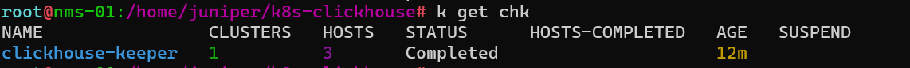
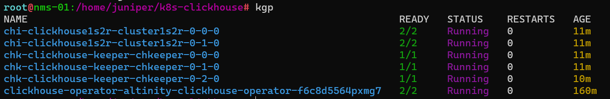
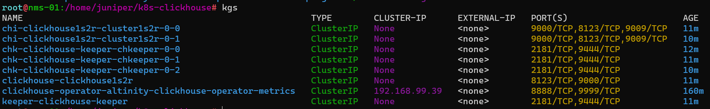

1. Add clickhouse operator helm repo:

   ```bash
   helm repo add clickhouse-operator https://docs.altinity.com/clickhouse-operator
   helm upgrade --install --create-namespace \
       --namespace clickhouse \
       clickhouse-operator \
       clickhouse-operator/altinity-clickhouse-operator
   ```

2. Apply Clickhouse Installation

   ```bash
   k apply -f 1shard-2repl.yaml
   ```

   ```yaml
   apiVersion: "clickhouse-keeper.altinity.com/v1"
   kind: "ClickHouseKeeperInstallation"
   metadata:
     name: clickhouse-keeper
     namespace: clickhouse
   spec:
     configuration:
       clusters:
         - name: "chkeeper"
           layout:
             replicasCount: 3
   
     defaults:
       templates:
         # Templates are specified as default for all clusters
         podTemplate: default
         dataVolumeClaimTemplate: default
   
     templates:
       podTemplates:
         - name: default
           metadata:
             labels:
               app: clickhouse-keeper
             containers:
               - name: clickhouse-keeper
                 imagePullPolicy: IfNotPresent
                 image: "clickhouse/clickhouse-keeper:latest"
                 resources:
                   requests:
                     memory: "256M"
                     cpu: "1"
                   limits:
                     memory: "4Gi"
                     cpu: "2"
             securityContext:
               fsGroup: 101
   
       volumeClaimTemplates:
         - name: default
           spec:
             accessModes:
               - ReadWriteOnce
             resources:
               requests:
                 storage: 10Gi
   ---
   apiVersion: v1
   kind: Secret
   metadata:
     name: clickhouse-credentials
     namespace: clickhouse
   type: Opaque
   stringData:
     # printf 'juniper-password' | sha256sum
     juniper_password_sha256_hex: "3c4e8a83eda0cbd497512a22ee2450bc8f8ba92026c1944972d6fc27768aea90"
   ---
   apiVersion: "clickhouse.altinity.com/v1"
   kind: "ClickHouseInstallation"
   metadata:
     name: "clickhouse1s2r"
     namespace: "clickhouse"
   spec:
     configuration:
       zookeeper:
         nodes:
           - host: keeper-clickhouse-keeper.clickhouse.svc.cluster.local
             port: 2181
       clusters:
         - name: "cluster1s2r"
           layout:
             shardsCount: 1
             replicasCount: 2
       users:
         juniper/password_sha256_hex:
           valueFrom:
             secretKeyRef:
               name: clickhouse-credentials
               key: juniper_password_sha256_hex
         juniper/networks/ip:
           - 0.0.0.0/0
     defaults:
       templates:
         podTemplate: clickhouse:24.8
         dataVolumeClaimTemplate: data-volume-template
         logVolumeClaimTemplate: log-volume-template
     templates:
       podTemplates:
         - name: clickhouse:24.8
           spec:
             containers:
               - name: clickhouse
                 image: clickhouse/clickhouse-server:24.8
       volumeClaimTemplates:
         - name: data-volume-template
           spec:
             accessModes:
               - ReadWriteOnce
             resources:
               requests:
                 storage: 100Gi
         - name: log-volume-template
           spec:
             accessModes:
               - ReadWriteOnce
             resources:
               requests:
                 storage: 100Mi
   ```

3. Result

   - chk:
     

   - chi:
     

   - pod:
     

   - svc:
     
   
     - **8123**, using for access via HTTP and JDBC
   
     - **9000**, native port, using for `clickhouse-client` command line
   
       ```bash
       k port-forward svc/clickhouse-clickhouse1s2r 9000 -n clickhouse
       ```
   
       

